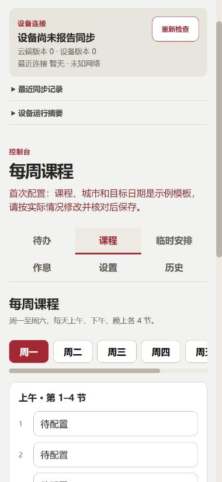

# J-Calendar Plus

基于 [JADE-Jerry/jcalendar](https://github.com/JADE-Jerry/jcalendar) 的 4.2 寸黑白红墨水屏日历扩展版：课程、月历、倒计时、天气和待办，配套可自行部署的手机配置网页。

**当前公开整理版：2.3.0。** 面向经典 ESP32、4 MB Flash、400 × 300 三色屏。原项目基础功能、驱动及作者信息保留于 [NOTICE](NOTICE.md)；许可证原文见 [LICENSE](LICENSE)。

## 能做什么

- 四页显示：课程＋倒计时、日间周课表、月历、待办；支持实体按键切页与深睡眠唤醒。
- 每周 12 节课程、作息与早读；指定日期放假、调课、独立起止时间，保存前核对。
- 学校安排在月历标记为红色「假」、黑色「课」，优先于一般节假日。
- 和风天气实时／三日缓存；有实际课程的放学前额外获取天气，提示带伞；提示只在放学前窗口出现。
- 手机网页编辑、草稿恢复、配置导入／导出、最近 10 个版本恢复、同步状态和有限日志。
- 主／备用 Wi-Fi、联网校时、证书校验、设备专用 Token、离线缓存及受限重试。

## 快速开始

1. 核对 [硬件和接线](docs/HARDWARE.md)：屏幕尺寸、三色、分辨率相同仍不代表驱动兼容。
2. 按 [刷机指南](docs/FLASHING.md) 选择驱动、编译／刷入对应固件。
3. 黑色上键唤醒，待刷新完成后长按约 5 秒松开，连接屏幕上的 `J-Calendar` 热点和 **设备随机的 12 位密码**，访问 `http://192.168.4.1`。
4. 填写 Wi-Fi、天气等本机配置。需要远程编辑时，按 [云端部署指南](docs/DEPLOYMENT.md) 部署自己的服务，并在设备填写自己的域名、Token 和根证书。
5. 手机网页中的课表／日期／城市是**待替换的模板**。配置真实数据、核对后保存；设备下次联网才应用，网页「保存成功」不等于设备已收到。

没有远程服务也可使用本机配置、月历、天气和本地课程显示。完整作息、临时安排和待办编辑建议使用配套网页。

## 兼容性

| 环境 | 对应驱动 | 验证范围 |
| --- | --- | --- |
| `z15` | `GxEPD2_420c` | 原硬件有实机使用记录；2.3.0 待配置首启仍待实机验收 |
| `z21` | `GxEPD2_420c_Z21` | 本次编译验证；需对应屏幕实测 |
| `z98` | `GxEPD2_420c_GDEY042Z98` | 本次编译验证；需对应屏幕实测 |
| `1680` | `GxEPD2_420c_1680` | 本次编译验证；需对应屏幕实测 |

具体类名以 [驱动选择头](include/GxEPD2_display_selection_new_style.h) 为准。ESP32-C3／S3 不在本版支持承诺内；二色屏也不能直接用三色包。不要仅凭商品「4.2 寸三色」选固件。

## 手机配置页面

下面是本地演示的待配置模板，不是私人配置：



## 本地开发

要求 Python 3.11、PlatformIO 6.2.0、Node.js 22 和 C++ 主机编译器（Linux `g++`；Windows 可指定 Zig）。

```sh
python -m pip install platformio==6.2.0
npm ci --prefix remote
python tools/verify.py --environment z15
# 分别验证其余环境：z21 / z98 / 1680
cd remote
npm run dev
```

本地网页为 `http://localhost:8787`，演示密码 `local-demo-only`；演示存储只在内存中，重启丢失，不能作为公网生产服务。开发命令与发布流程见 [维护指南](MAINTENANCE.md)。

## 文档

- [使用与刷新逻辑](docs/USAGE.md)
- [硬件／接线](docs/HARDWARE.md) · [刷机](docs/FLASHING.md)
- [手机网页与云端部署](docs/DEPLOYMENT.md)
- [配置格式和模板](examples/README.md)
- [故障排查](docs/TROUBLESHOOTING.md)
- [维护](MAINTENANCE.md) · [版本变化](CHANGELOG.md)
- [参与贡献](CONTRIBUTING.md) · [安全问题](SECURITY.md)

## 项目定位与授权状态

维护者希望用于个人学习，不希望用于商业产品。目前保留上游 GPLv3 原文；这项意愿**不是对 GPLv3 的额外非商业限制**。上游文字说明与许可证的关系以及第三方素材授权核查暂缓，本次整理没有给出可限制商业使用的新授权。发布前需要进一步确认，详见 [NOTICE](NOTICE.md)。

当前服务是一人一设备设计；未新增多用户系统或分布式并发保存。设备离线时无法即时收到手机修改，也无法实时上传故障原因。
